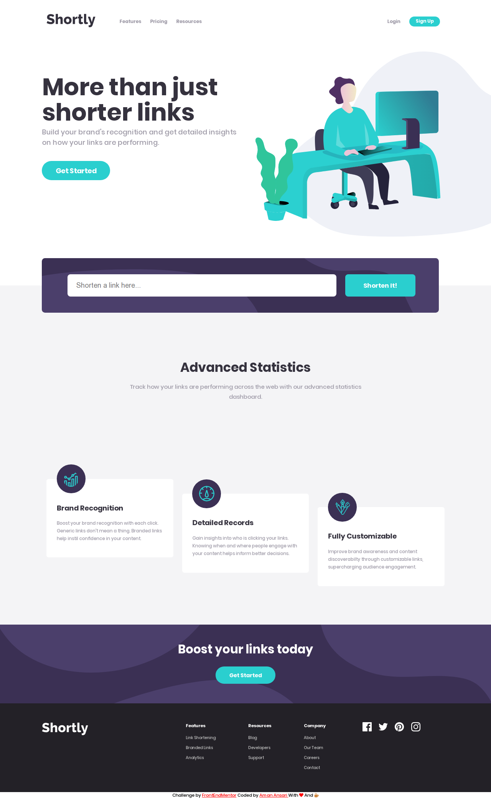

<h2  align="center" > Shortly URL Shortening API Challenge </h2>


   <p align="center">This project uses <a href="https://rel.ink"> Relink </a> APIs to shorten links and providing them to the user.  </p >
  <p align="center"> It was a challenge project given by <a href="https://frontendmentor.io"> FrontEndMentor </a> . ( And I really enjoyed it!!!)   </p >
   <p align="center">I used React and SCSS (+ Flexbox) to build this and Login/Signup Button are intentially not workable.</p >
   <p align="center">  </p>
 
## Getting Started

Start by cloning the repo : 
```sh
git clone https://github.com/aman-atg/Short-Link-MeteorReact
```
Or Download and extract the zip file.

### Prerequisites

* A modern-web browser like Brave , Chrome , Firefox etc
* SASS on your system -> [Go to the download page](https://sass-lang.com/install)
* Node

### Running

1. Install NPM packages
```sh
npm i OR npm install OR yarn 
```
2. Run 
```sh
yarn run dev OR npm run dev
```
3. Open your browser and go to http://127.0.0.1:3000 OR https://localhost:3000

## Built With

* [ReactJs](https://reactjs.org) - A JavaScript library for building user interfaces
* [SCSS](https://sass-lang.com) - CSS with superpowers
* [Javascript](https://www.javascript.com/) - High-level, interpreted programming language
* [ClipboardJs](https://clipboardjs.com) - A modern approach to copy text to clipboard
* [UUID](https://www.npmjs.com/package/uuid) - To create Unique IDs
* [Axios](https://www.npmjs.com/package/axios) - Promise based HTTP client for the browser and node.js
* [SimpleSchema](https://github.com/aldeed/simple-schema-js) - Validates JavaScript objects to ensure they match a schema
* [HTML](https://www.html.com/) - Standard markup language

## Authors

* **[Aman Ansari](https://github.com/aman-atg)**

## License

This project is licensed under the MIT License - see the [LICENSE.md](https://github.com/aman-atg/Shortly-Landing-Page/blob/master/LICENSE) file for details

## Acknowledgements

* [FrontEndMentors](https://frontendmentors.io)
* [Relink](https://rel.ink)
